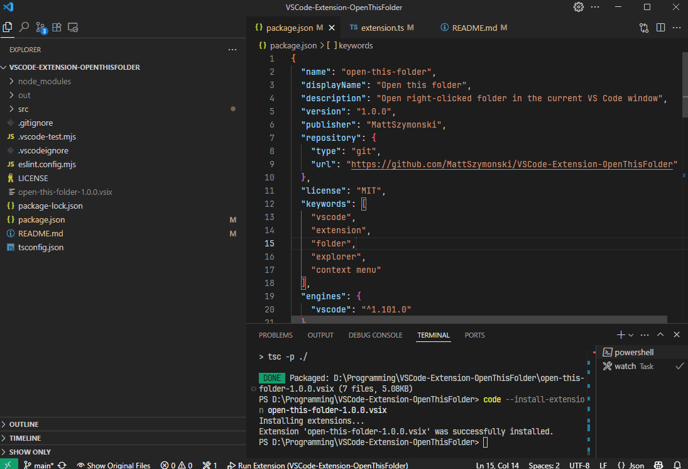

# Open This Folder - VS Code Extension

VS Code extension that adds a context menu command to open the right-clicked folder in the **current window**, replacing the existing workspace.

## Usage

1. Right-click a folder in the Explorer file tree
2. Click “Open This Folder”
3. Folder will be opened in the current window

  

