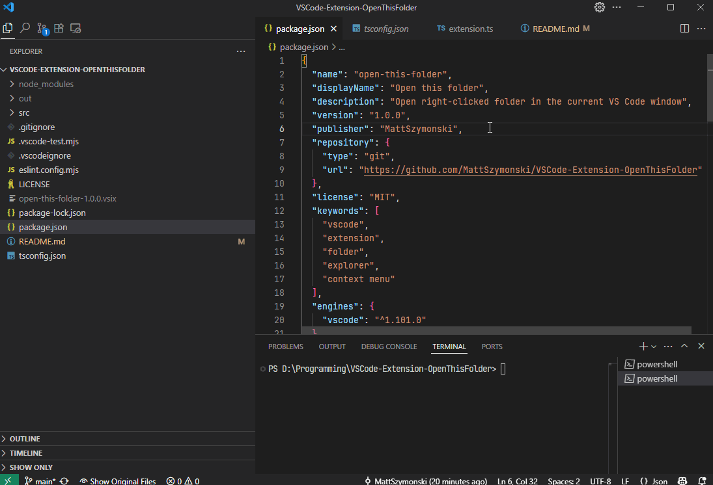

# Open This Folder - VS Code Extension

VS Code extension that adds a context menu command to open the right-clicked folder in the **current window**, replacing the existing workspace.

## Usage

1. Right-click a folder in the Explorer file tree
2. Click “Open This Folder”
3. Folder will be opened in the current window

  

## Installation

1. [Download the latest `.vsix` file](https://github.com/MattSzymonski/VSCode-Extension-OpenThisFolder/releases)
2. In VS Code, open the Command Palette (`Ctrl+Shift+P`)
3. Choose **"Extensions: Install from VSIX..."**
4. Select the downloaded `.vsix` file